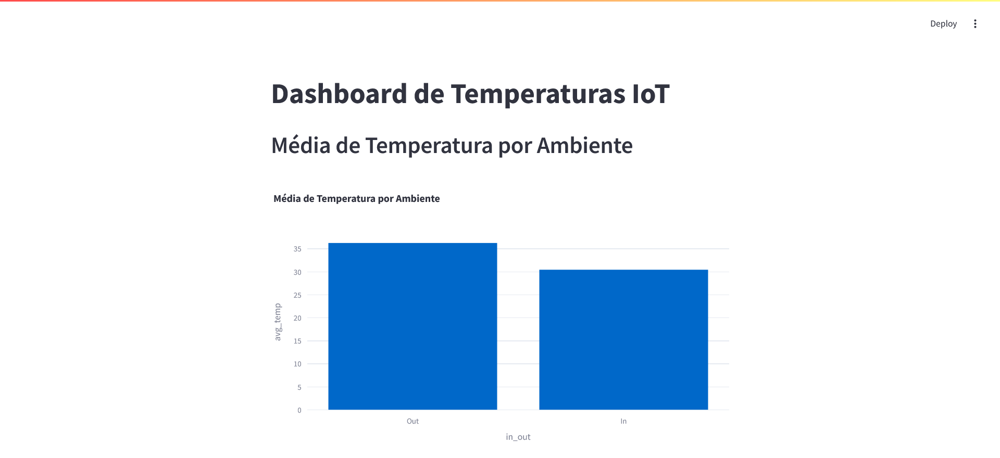
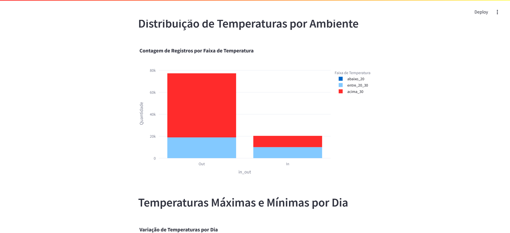
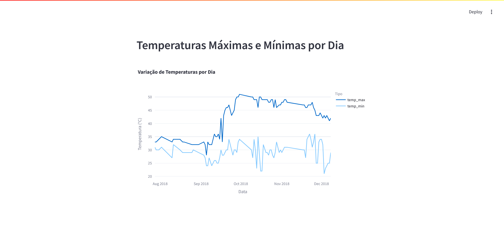

# Monitoramento de Temperatura com PostgreSQL e Streamlit

## Sobre o Projeto

Este projeto tem como objetivo monitorar e visualizar dados de temperatura armazenados em um banco de dados PostgreSQL. Os dados são extraídos de um arquivo CSV, inseridos no banco e posteriormente analisados através de views SQL e visualizações interativas utilizando Streamlit e Plotly.

---

## Screenhots







## Tecnologias Utilizadas

- **Python** (Manipulação de dados e integração com o banco)
- **PostgreSQL** (Armazenamento e processamento dos dados)
- **SQLAlchemy** (ORM para interagir com o banco de dados)
- **Pandas** (Leitura e tratamento de arquivos CSV)
- **Streamlit** (Criação do dashboard interativo)
- **Plotly** (Visualização gráfica dos dados)

---

## Configuração e Execução

### **Configurar o Banco de Dados PostgreSQL**

1. **Criar um banco de dados**:

Com o postgres já rodando, basta executar o seguinte comando para criar o banco de dados:

```sql
CREATE DATABASE iot;
```

### **Instalar Dependências**

No diretório do projeto, execute:

```bash
pip install -r requirements.txt
```

O arquivo `requirements.txt` deve conter:

```txt
pandas
sqlalchemy
psycopg2-binary
streamlit
plotly
```

### **Carregar Dados CSV para o Banco**

Execute o script para preparar o banco com os dados do CSV:

```bash
python db_setup.py
```

O script `db_setup.py` realiza as seguintes operações:

- Lê o arquivo CSV
- Converte os dados para um formato adequado
- Insere os dados no banco PostgreSQL
- Cria as views necessárias para os gráficos

### **Executar o Dashboard Streamlit**

Para visualizar os gráficos, execute:

```bash
streamlit run dashboard.py
```

Isso abrirá o dashboard no navegador com as visualizações interativas.

---

## Funcionalidades do Dashboard

1. **Gráfico de Barras**: Média de temperatura por ambiente (interno/externo).
2. **Gráfico de Barras Empilhadas**: Contagem de registros por faixa de temperatura.
3. **Gráfico de Linhas**: Temperaturas máximas e mínimas registradas ao longo do tempo.

Cada visualização utiliza dados diretamente das views SQL para maior eficiência.

## Descrição das Views

### `avg_temp_por_ambiente`
Esta view calcula a **temperatura média** para cada categoria de ambiente (`in_out`).
```sql
CREATE OR REPLACE VIEW avg_temp_por_ambiente AS
SELECT in_out, AVG(temp) AS avg_temp
FROM temperature_logs
GROUP BY in_out;
```
**Uso:** Permite visualizar a média de temperatura para ambientes internos e externos.

### `contagem_por_faixa_temp`
Esta view agrupa as temperaturas em **faixas de valores** e conta quantas leituras existem em cada uma delas.
```sql
CREATE OR REPLACE VIEW contagem_por_faixa_temp AS
SELECT in_out,
       COUNT(CASE WHEN temp < 20 THEN 1 END) AS abaixo_20,
       COUNT(CASE WHEN temp BETWEEN 20 AND 30 THEN 1 END) AS entre_20_30,
       COUNT(CASE WHEN temp > 30 THEN 1 END) AS acima_30
FROM temperature_logs
GROUP BY in_out;
```
**Uso:** Permite identificar padrões de temperatura e sua distribuição em diferentes ambientes.

### `temp_max_min_por_dia`
Esta view calcula a **temperatura máxima e mínima** registrada para cada dia.
```sql
CREATE OR REPLACE VIEW temp_max_min_por_dia AS
SELECT DATE(noted_date) AS data,
       MAX(temp) AS temp_max,
       MIN(temp) AS temp_min
FROM temperature_logs
GROUP BY DATE(noted_date)
ORDER BY data;
```
**Uso:** Permite acompanhar as variações extremas de temperatura ao longo do tempo.

## Possíveis Insights Obtidos dos Dados

1. **Padrões de Temperatura por Ambiente:**
   - Comparando a temperatura média de ambientes internos e externos, é possível identificar quais locais sofrem maior variação térmica ao longo do dia.
  
2. **Distribuição das Temperaturas:**
   - Através da `contagem_por_faixa_temp`, podemos entender a frequência com que certas faixas de temperatura ocorrem e se há necessidade de controle térmico em determinados períodos.
  
3. **Análise de Tendências Climáticas:**
   - A view `temp_max_min_por_dia` permite observar a evolução das temperaturas extremas ao longo do tempo, ajudando na identificação de tendências sazonais ou anomalias climáticas.
  
4. **Impacto de Eventos Externos:**
   - Se cruzarmos esses dados com informações meteorológicas ou horários de funcionamento de determinados locais, podemos entender como fatores externos influenciam a temperatura em diferentes ambientes.
